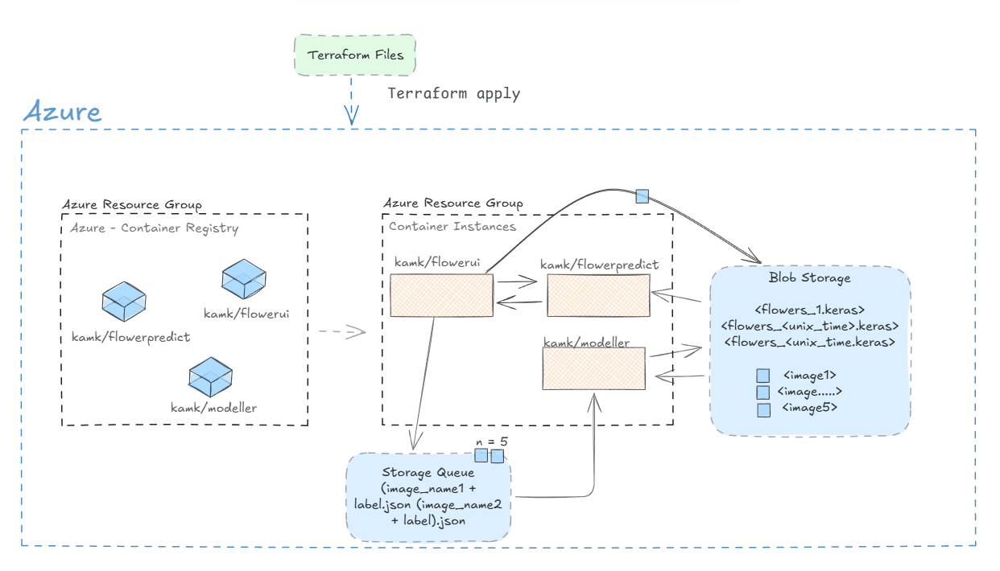

# Kukkaluokitteluohjelma (Flower Classifier) 

**Tekijä:** Nadina Hakkarainen

**Kurssi:** Online learning 2025

_Tämän reporsitorion pohjana on käytetty kurssimateriaalina toimivaa [ope-olearn](https://repo.kamit.fi/online-learning-2024/ope-olearn) -repositoryä (Sourander J. 2024)._


---

Tämä ohjelmakokonaisuus tarjoaa kokonaisratkaisun kuvapohjaiseen kukkadatan luokitteluun ja mallin päivittämiseen käyttäjän palautteen perusteella. 

**Ratkaisu koostuu kolmesta osasta:** 

1. Front-end
2. Back-end
3. Mallin koulutus

Ohjelmakokonaisuudet ovat pilvipalvelussa (Azure), jonka arkkitehtuuria hallinoidaan Terraformin avulla. 





## Ominaisuudet 

1. Kuvien luokittelu viiteen eri kukkaluokkaan (dandelion, daisy, tulips, sunflowers, roses) streamlit-pohjaisessa käyttöliittymässä. Luokittelijamallina hyödynnetään viimeisintä mallia. 
2. Kuvien lähettäminen "jonoon", käyttäjäpalaute
    - Käyttöliittymä mahdollistaa kukkakuvan tallennuksen Azuren Blob Storageen
    - Samalla tiedot kuvasta sekä oikeasta luokasta tallennetaan json-muodossa Azure Queueen. 
3. Mallin koulutus
    - Uudelleenkoulutus käynnistyy automaattisesti, kun jonossa havaitaan olevan tiedot viidestä kukkakuvasta ja -luokasta. 
    - Blob Storagessa olevat kuvat prosessoidaan
    - Uusi malli tallennetaan Azuren Blob Storageen
4. Azuren infrastruktuuria hallinnoidaan Terraformin avulla


## KÄYTTÖOHJEET

### Kloonaa repositorio

```bash
git clone ssh://git@repo.kamit.fi:45065/online-learning-2024/nadinalehtonen.git
```


### Kirjaudu Azure CLI:llä sisään

```bash
az login
```

**Valitse oikea tenant & subscription:** 

[1] KAMK TT00CC64 Online Learning 

### Luo Azureen Container Registry (docker imageille)

```bash
cd infra/tf/container_registry

terraform init --upgrade
terraform apply
```

**Peruuta projektin juureen:** 

3 x
```bash
cd ..
```

### Kirjaudu Azure Container Registryyn skriptillä

```bash
./scripts/01_acr_login.sh
```

### Buildaa flowerpredict, flowerui ja modeller

```bash
./scripts/02_build_n_release.sh flowerpredict 1.0
```
```bash
./scripts/02_build_n_release.sh flowerui 1.0
```
```bash
./scripts/02_build_n_release.sh modeller 1.0
```

### Julkaise Services tf-skriptien mukaiset palvelut

```bash
cd infra/tf/services

terraform init --upgrade
terraform apply

# Voit seurata logeja näin (Ctrl+C lopettaa)
az container logs --resource-group rg-identifier-olearn --name ci-identifier-olearn --follow
```

### Luokittele kukkakuvia ja kouluta mallia uudelleen

**Kukkien luokittelu**
1. Avaa Streamlit-käyttöliittymä terraformin outputsien mukaisesta osoitteesta. 
2. Lataa kuva kukasta.
3. Katso ennustettu luokka ja varmuus.

**Palautteen antaminen ja mallin uudelleenkoulutus**
1. Valitse kuvan oikea luokka, jos ennuste oli väärin.
2. lähetä kuva Azure Queueen.

Kun `modeller` tunnistaa jonossa olevan 5 kuvaa, sen uudelleenkoulutus käynnistyy automaattisesti. 

Uudelleenkoulutetut mallit tallennetaan Blob Storageen ja kukkia luokkia tunnistetaan jatkossa uusimmalla mallilla. 

### Muista aina poistaa palvelut

Aja seuraava komento ensin `services`-hakemistossa ja sitten `container_registry`-hakemistossa:

```bash
terraform destroy
```

